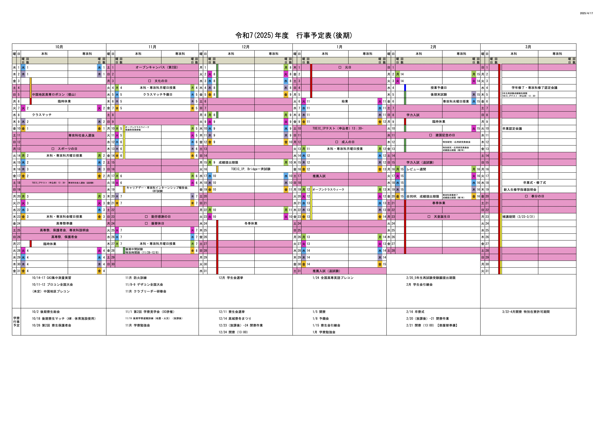

# テスト対策

- [テスト対策](#テスト対策)
	- [更新情報](#更新情報)
	- [日課](#日課)
	- [行事予定](#行事予定)

## 更新情報

[2025/09/28：日課を変更しました](UPDATE.md)

## 日課

タップするとシラバスに飛びます

| 曜日 | 1限                           | 2限                            | 3限                          | 4限                              |
| :--- | :---------------------------- | :----------------------------- | :--------------------------- | :------------------------------- |
| 月   | [電気電子回路][def:電気電子]  | [数学IIB][def:数学B]           | [体育][def:体育]             | [コンピューター工学][def:コン工] |
| 火   | [数学IIA][def:数学A]          | [倫理][def:倫理]               | [歴史][def:歴史]             | [課題発見][def:課題発見]         |
| 水   | [物理I][def:物理I]            | [総合英語IW][def:英語W]        | [集合と論理][def:集合と論理] | [化学II][def:化学II]             |
| 木   | [情報工学演習I][def:情報演習] | [芸術][def:芸術]               | [数学IIB][def:数学IIB]       | HR                               |
| 金   | [国語II][def:国語II]          | [プログラミング][def:プログラ] | [総合英語IR][def:英語R]      | -                                |

## 行事予定

<!--

以下定義

-->
[def:電気電子]:https://syllabus.kosen-k.go.jp/Pages/PublicSyllabus?school_id=35&department_id=03&subject_id=0034&year=2024&lang=ja
[def:数学B]:https://syllabus.kosen-k.go.jp/Pages/PublicSyllabus?school_id=35&department_id=03&subject_id=0046&year=2024&lang=ja
[def:体育]:https://syllabus.kosen-k.go.jp/Pages/PublicSyllabus?school_id=35&department_id=03&subject_id=0027&year=2024&lang=ja
[def:コン工]:https://syllabus.kosen-k.go.jp/Pages/PublicSyllabus?school_id=35&department_id=03&subject_id=0042&year=2024&lang=ja
[def:数学A]:https://syllabus.kosen-k.go.jp/Pages/PublicSyllabus?school_id=35&department_id=03&subject_id=0045&year=2024&lang=ja
[def:倫理]:https://syllabus.kosen-k.go.jp/Pages/PublicSyllabus?school_id=35&department_id=03&subject_id=0037&year=2024&lang=ja
[def:歴史]:https://syllabus.kosen-k.go.jp/Pages/PublicSyllabus?school_id=35&department_id=03&subject_id=0036&year=2024&lang=ja
[def:課題発見]:https://syllabus.kosen-k.go.jp/Pages/PublicSyllabus?school_id=35&department_id=03&subject_id=0024&year=2024&lang=ja
[def:物理I]:https://syllabus.kosen-k.go.jp/Pages/PublicSyllabus?school_id=35&department_id=03&subject_id=0047&year=2024&lang=ja
[def:英語W]:https://syllabus.kosen-k.go.jp/Pages/PublicSyllabus?school_id=35&department_id=03&subject_id=0039&year=2024&lang=ja
[def:集合と論理]:https://syllabus.kosen-k.go.jp/Pages/PublicSyllabus?school_id=35&department_id=03&subject_id=0041&year=2024&lang=ja
[def:化学II]:https://syllabus.kosen-k.go.jp/Pages/PublicSyllabus?school_id=35&department_id=03&subject_id=0032&year=2024&lang=ja
[def:情報演習]:https://syllabus.kosen-k.go.jp/Pages/PublicSyllabus?school_id=35&department_id=03&subject_id=0049&year=2024&lang=ja
[def:芸術]:https://syllabus.kosen-k.go.jp/Pages/PublicSyllabus?school_id=35&department_id=03&subject_id=0030&year=2024&lang=ja
[def:数学IIB]:https://syllabus.kosen-k.go.jp/Pages/PublicSyllabus?school_id=35&department_id=03&subject_id=0046&year=2024&lang=ja
[def:国語II]:https://syllabus.kosen-k.go.jp/Pages/PublicSyllabus?school_id=35&department_id=03&subject_id=0035&year=2024&lang=ja
[def:プログラ]:https://syllabus.kosen-k.go.jp/Pages/PublicSyllabus?school_id=35&department_id=03&subject_id=0043&year=2024&lang=ja
[def:英語R]:https://syllabus.kosen-k.go.jp/Pages/PublicSyllabus?school_id=35&department_id=03&subject_id=0038&year=2024&lang=ja